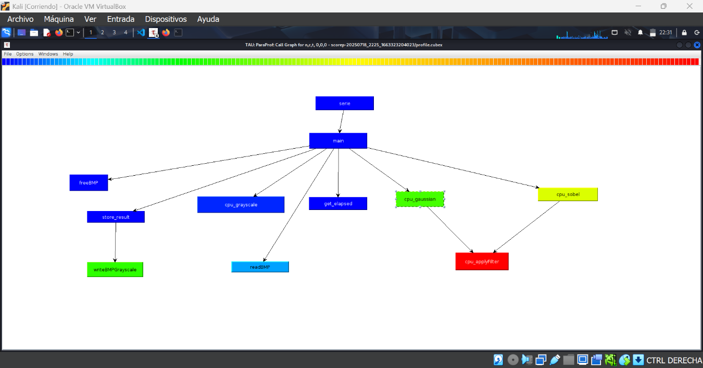
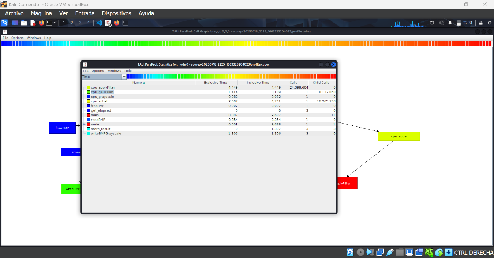
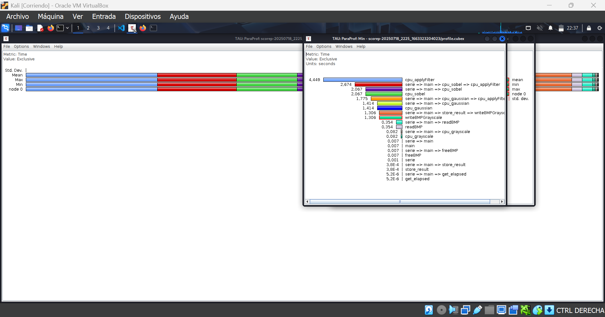

# Tp final de programación paralela 2025

## Consigna
Edge-detecting 
Partiendo del código de ejemplo en: https://github.com/steven-chien/DD2360-HT19.git
Implementar los 3 pasos (grayscale, gauss filter y sobel filter)
 
Deben realizarse 4 implementaciones:

- [x] CPU serie 
- [x] CPU con openMP
- [x] CUDA con global memory
- [ ] CUDA con shared memory
 
Analizar y documentar las diferencias de performance entre las 4 implementaciones
 
MPI.
- [ ] Paralelizar con MPI el código de mergesort.c https://w3.cs.jmu.edu/lam2mo/cs470_2017_01/files/mergesort.c  
1. randomize() Se ejecuta en el nodo 0 y se reparten los datos equitativamente entre el total de nodos.
2. Cada nodo calcula el histograma de sus datos.
3. Cada nodo ordena sus datos y luego se juntan y ordenan con merge().

# --------------------------------------------------------------------------------------------------

descargar imagenes de https://github.com/steven-chien/DD2360-HT19/tree/master/Assignment_3/ex_1/images

la imagen que usaremos de prueba será un panorama propio bastante grande para poder sacarle 
el jugo al procesamiento paralelo: https://drive.google.com/file/d/1yRuvlly71oMsmeUvxzhWGPbMVOz7R2Ba/view?usp=sharing

# Análisis de rendimiento con Profiling

Para este proyecto utilizamos herramientas de profiling para medir y analizar el rendimiento de programas en diferentes modalidades: serie, OpenMP y CUDA.

## Herramientas utilizadas:

- **Score-P:** Framework moderno para instrumentar programas y recolectar métricas de ejecución.
- **TAU (Tuning and Analysis Utilities):** Herramienta complementaria para profiling y tracing.
- **ParaProf:** Visualizador gráfico de perfiles generados por TAU o Score-P.

Estas herramientas permiten identificar las partes del código donde se consume más tiempo y recursos, ayudando a guiar la optimización.

## Perfilado en ejecución serial

Se comienza analizando la ejecución en serie para establecer una línea base. El profiling en serie muestra el tiempo que consume cada función y la frecuencia de llamadas.

Con esta información se pueden identificar los cuellos de botella y “hotspots”, o funciones críticas donde enfocar mejoras.

## Call Graph

  

- El nodo principal `main` ejecuta las funciones centrales de procesamiento.

- La función más costosa es `cpu_applyFilter`, que es llamada desde los filtros Gaussian y Sobel, y tiene el mayor tiempo exclusivo.

- Las funciones `cpu_gaussian` y `cpu_sobel` también consumen tiempos significativos, confirmando que el filtrado es la parte más pesada.

- Las funciones de lectura y escritura (`readBMP`, `writeBMPGrayscale`) tienen un impacto menor en el tiempo total.

## Estadísticas de Tiempo (Lista de Funciones)

  

- `cpu_applyFilter` registra un tiempo exclusivo de aproximadamente 4.4 segundos, el más alto en el programa.

- `cpu_sobel` tarda cerca de 2 segundos, y `cpu_gaussian` un poco más de 1 segundo.

- Las funciones relacionadas con entrada/salida y conversión (como `readBMP`, `cpu_grayscale`) son mucho más rápidas.

Esto indica que optimizar o paralelizar el filtrado tendrá el mayor impacto en el rendimiento general.

## Gráfico de Barras de Tiempos Mínimos

  

- Se muestran los tiempos mínimos medidos (en segundos) para cada función.

- Se confirma que `cpu_applyFilter` y los filtros Sobel/Gaussian son los procesos que más tiempo consumen.

- La función `writeBMPGrayscale` también tiene un tiempo notable, aunque menor.

## Conclusión

El profiling en serie muestra que la mayor carga está en la aplicación de filtros (sobel y gaussiano) mediante la función genérica `cpu_applyFilter`. La lectura, escritura y conversión a escala de grises son relativamente rápidas. Esto permite priorizar paralelizar su ejecución.

